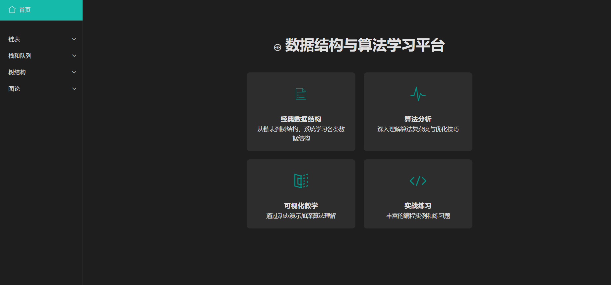

# 数据结构与算法学习平台



## 项目简介

这是一个基于Web的数据结构与算法可视化学习平台，旨在帮助开发者更好地理解和掌握各种数据结构与算法。

## 主要特性

- 📚 **经典数据结构**：包含链表、栈、队列、树等基础数据结构的详细讲解
- 📊 **算法分析**：深入剖析算法的时间复杂度与空间复杂度
- 🎯 **可视化教学**：通过动态演示加深对算法的理解
- 💻 **实战练习**：提供丰富的编程实例和练习题

## 技术栈
+ 课件
  - HTML5
  - CSS3
  - JavaScript
  - Layui 框架
  - Draw.io (图表绘制)
+ 实战
  + C语言

## 功能模块

### 1. 链表
- 单向链表
- 双向链表
- 循环链表

### 2. 栈和队列
- 栈的实现与应用
- 队列结构详解
- 双端队列

### 3. 树结构
- 二叉树
- AVL树
- 红黑树

### 4. 图论
- 基础图结构
- 最短路径算法

## 本地运行

1. 克隆仓库
```bash
git clone https://github.com/caoaolong/DataStructuresAndAlgorithms.git
```

2. 打开项目目录
```bash
cd DataStructuresAndAlgorithms
```

3. 使用浏览器打开
```bash
start index.html
```

## 目录结构

```
DataStructuresAndAlgorithms/
├── index.html          # 主页面
├── welcome.html        # 欢迎页面
├── styles.css          # 样式文件
├── images/            # 图片资源
├── book/              # 教程文档
├── pages/             # 内容页面
└── layui/             # UI框架
```

## 贡献指南

欢迎提交 Issue 或 Pull Request 来帮助改进项目。

## 许可证

MIT License